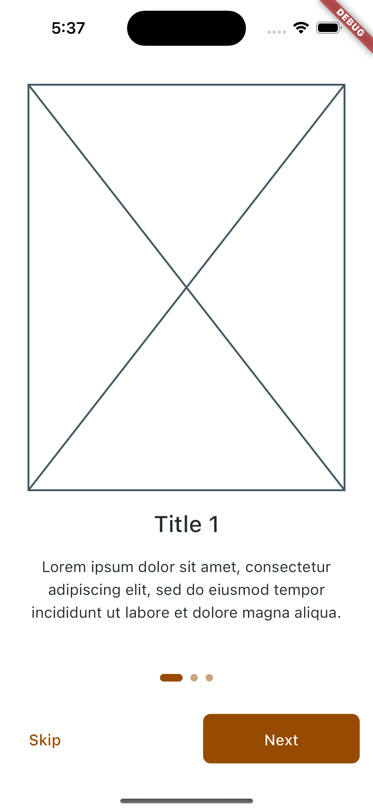

# Find coffee

This is an application that shows information about coffee stores in your zone, built with Flutter.

---

## Run application

Install dependencies

```bash
  flutter pub get
```

Launch your prefer iOS simulator or Android emulator

```bash
  flutter emulators --launch <emulator_id> 
```

Start the app

```bash
  flutter run
```

---

## Screenshots

| Android                                                                     | iOS                                                                     |
|-----------------------------------------------------------------------------|-------------------------------------------------------------------------|
|  |  |
|        |        |