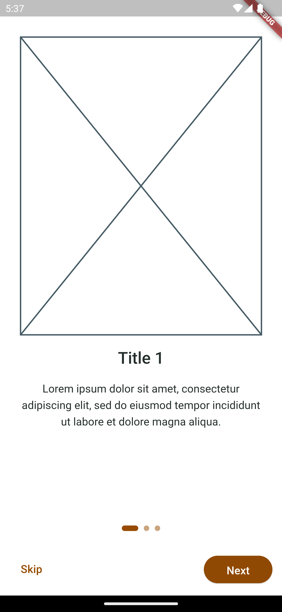

# Find coffee

This is an application that shows information about coffee stores in your zone, built with Flutter.

---

## Automation
This project uses:
- [Makefile](Makefile): to have some handy commands like build autogenerated files and so on.
```bash
$ make
```

---

## Run application

Install dependencies

```bash
  flutter pub get
```

Generate I18n file

```bash
  make generate_i18n
```

Launch your prefer iOS simulator or Android emulator

```bash
  flutter emulators --launch <emulator_id> 
```

Start the app

```bash
  flutter run
```

---

## Screenshots

| Android                                                                     | iOS                                                                     |
|-----------------------------------------------------------------------------|-------------------------------------------------------------------------|
|  |  |
|         |         |
|       |       |